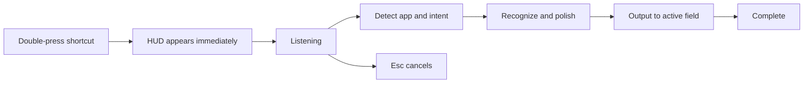

# ReadyType 1.2.0 Interaction Architecture

## Primary Flow

## Decision Priority

1. Explicit instruction spoken in the current run.
2. Explicit secondary action selected by the user.
3. Current app and input context.
4. Saved default preference.
5. Generic cleanup fallback.

Automatic behavior is the product default, not a mode users must understand.

## App Contexts

| App category | Default output | HUD label |
| --- | --- | --- |
| WeChat, Messages, Slack | Concise and natural | Natural chat |
| Mail, Outlook | Email paragraphs, lists, and closing | Email format |
| Notes, Obsidian | Dense information with useful breaks | Clear notes |
| Pages, Word, TextEdit | Complete document structure | Document |
| ChatGPT, Claude, Cursor | Preserve task and constraints | AI instruction |
| Unknown apps | Generic cleanup without guessing | Smart cleanup |

## Main Window

The main window separates Home, Common Words, Language and Output, Shortcuts, Speech Recognition, Permissions and Privacy, and About. Settings are not duplicated in the menu-bar popover.

## Error Recovery

- Missing microphone permission: offer the relevant System Settings action.
- Missing Accessibility permission: copy the result and offer automatic insertion permission.
- DeepSeek unavailable: preserve recognized text and explain that original text was used.
- High-accuracy recognition unavailable: fall back to fast recognition without blocking input.
