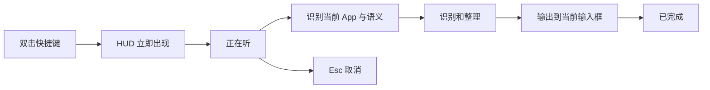
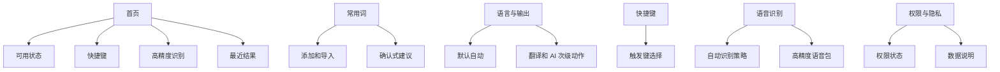
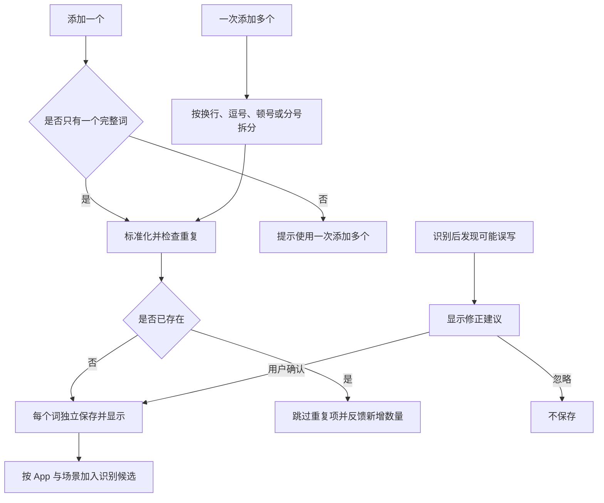

# ReadyType 1.2.0 交互架构

## 核心输入流程

## 决策优先级

1. 用户本次明确说出的指令。
2. 用户明确选择的次级操作。
3. 当前 App 与输入框上下文。
4. 用户保存的默认偏好。
5. 通用整理兜底。

“自动”不再作为需要理解的模式显示在主界面，而是产品默认行为。

## App 场景

| App 类别 | 默认输出 | HUD 短标签 |
| --- | --- | --- |
| 微信、Messages、Slack | 简洁自然，避免过度礼貌 | 自然聊天 |
| Mail、Outlook | 邮件段落、列表和落款 | 邮件排版 |
| 备忘录、Obsidian | 保留信息密度，合理分段 | 清晰笔记 |
| Pages、Word、TextEdit | 完整句子和文档结构 | 文档整理 |
| ChatGPT、Claude、Cursor | 保留任务目标和约束 | AI 指令 |
| 未知 App | 通用整理，不猜测 | 智能整理 |

## 主窗口

## 菜单栏

菜单栏浮窗只保留当前可用状态、开始说话、三个次级动作、打开 ReadyType 和退出。设置项不在浮窗中重复。

## 常用词交互

空格永远保留在词语内部，例如 `GitHub Actions`。列表中的每一行都是一个可独立参与识别和删除的正确写法。

## 错误恢复

- 无麦克风权限：显示“允许使用麦克风”，进入对应设置。
- 无辅助功能权限：结果复制到剪贴板，并提供“允许自动输入”。
- DeepSeek 不可用：保留识别文本，明确“已使用原始文字”。
- 高精度识别不可用：自动使用快速识别，不阻塞输入。
