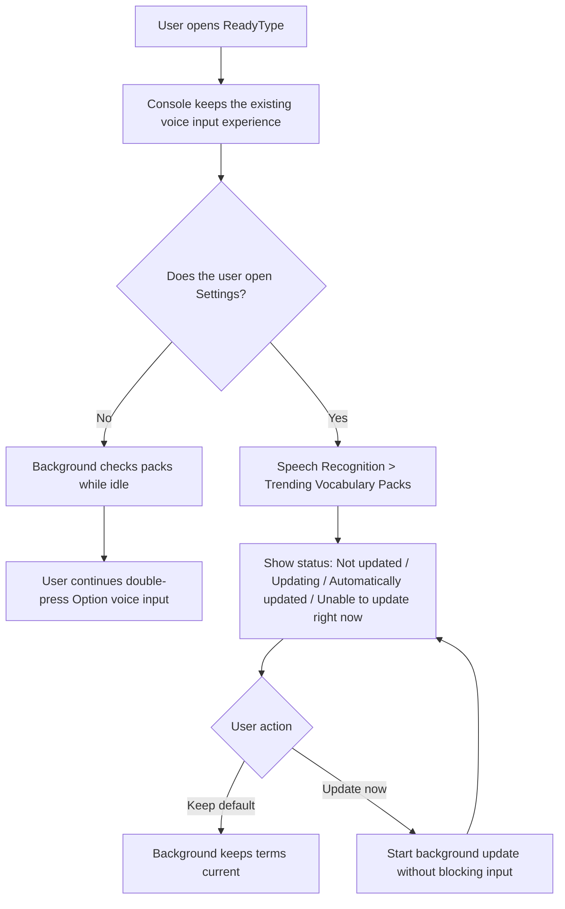
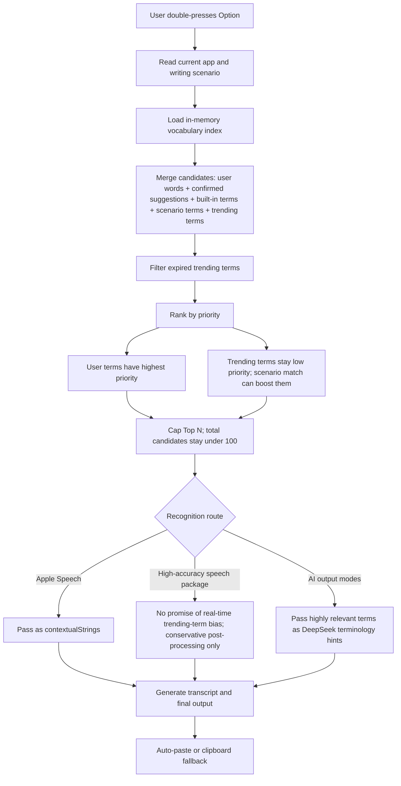
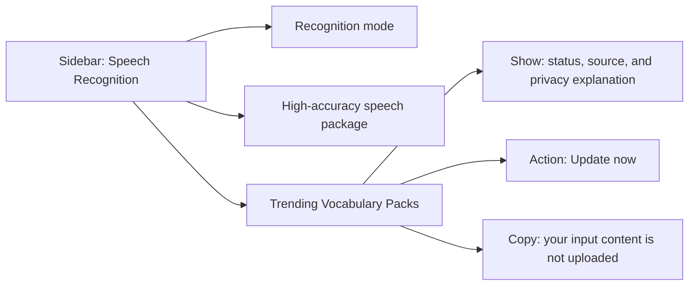

# ReadyType 1.4.0 Interaction Flow: Trending Vocabulary Packs

## 1. User-Visible Interaction

Goal: enabled silently by default; users see Trending Vocabulary Packs only when checking status or requesting an update.

## 2. Background Update Interaction

Goal: failed updates do not show alerts, interrupt recording, or affect automatic paste.

```mermaid
stateDiagram-v2
    [*] --> WaitingIdle: Delayed check after app launch
    WaitingIdle --> Skipped: Recording/transcribing/processing/outputting
    Skipped --> WaitingIdle: Back to idle
    WaitingIdle --> CheckNeeded: Last check was more than one day ago
    WaitingIdle --> NoCheck: Already checked today
    CheckNeeded --> Downloading: Update in background
    Downloading --> Updated: Hash and signature are valid; atomic replacement succeeds
    Downloading --> KeepOld: Download fails but old packs exist
    Downloading --> Unavailable: Download fails and no local pack exists
    Updated --> [*]: Settings shows updated
    KeepOld --> [*]: Keep old packs; Settings shows unable to update right now
    Unavailable --> [*]: No candidates; Settings shows unable to update right now
    NoCheck --> [*]
```

## 3. Candidate Decision During Voice Input

Goal: trending terms are low-priority supplements and must not pollute user vocabulary or ordinary expressions.

## 4. Settings Information Structure

## Interaction Principles

- The normal voice input path adds no new popovers.
- Trending pack updates must not block input after double-pressing `Option`.
- Settings only shows user-readable states, not API, manifest, or hash details.
- Do not expose pack versions, category switches, file locations, or deletion controls.
- Failed updates keep the previous valid pack; without one, existing recognition remains unchanged.
