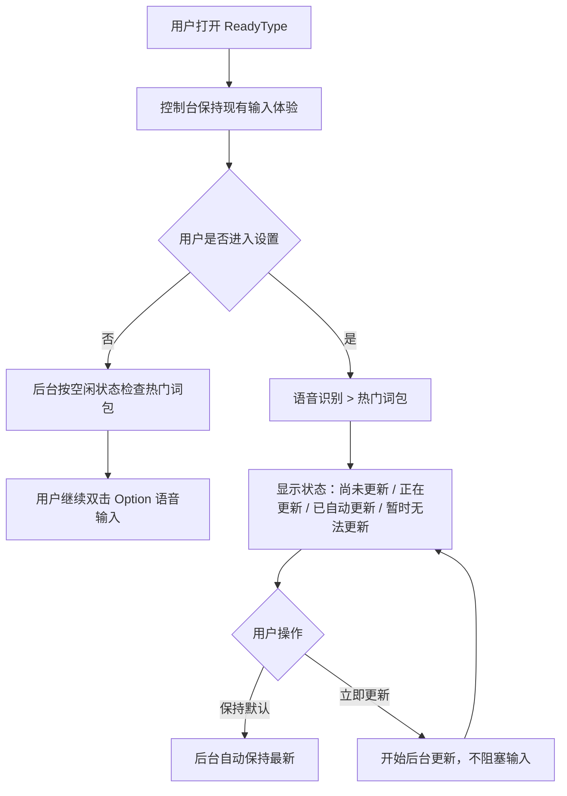
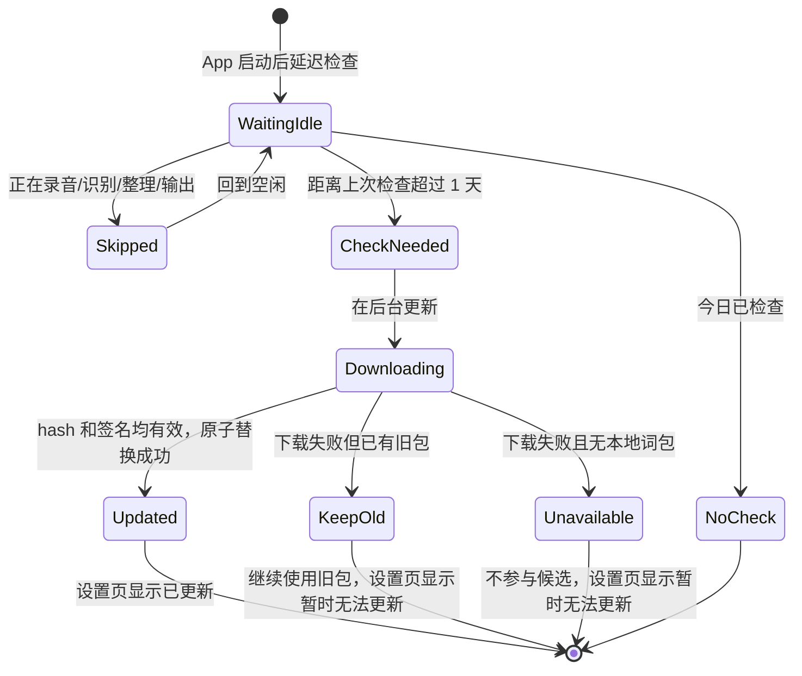
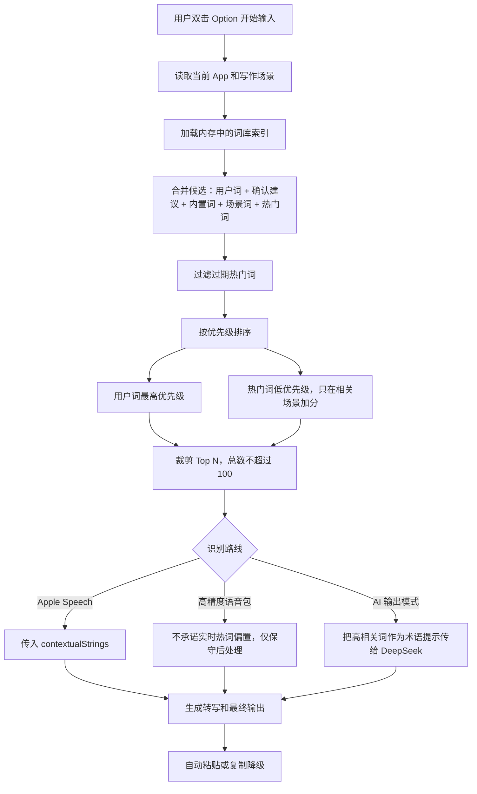
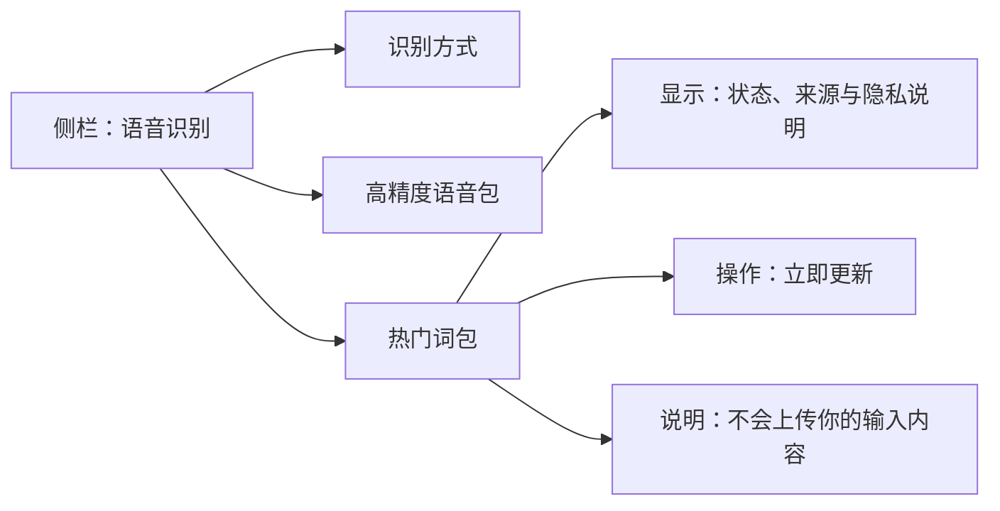

# ReadyType 1.4.0 交互图：热门词包

## 1. 用户可见交互

目标：默认无感启用；用户只在需要确认状态或主动更新时看到热门词。

## 2. 后台更新交互

目标：更新失败不弹窗、不打断录音、不影响自动粘贴。

## 3. 语音输入时的候选词决策

目标：热门词只做低优先级补充，不能污染用户词和普通表达。

## 4. 设置页信息结构

## 交互原则

- 正常语音输入路径不增加任何弹窗。
- 热门词包更新不能阻塞双击 `Option` 后的输入。
- 设置页只展示用户能理解的状态，不暴露 API、manifest、hash 等技术细节。
- 不向用户暴露词包版本、分类开关、文件位置或删除操作。
- 更新失败时继续使用上一份有效词包；没有有效词包时保持原有识别能力。
