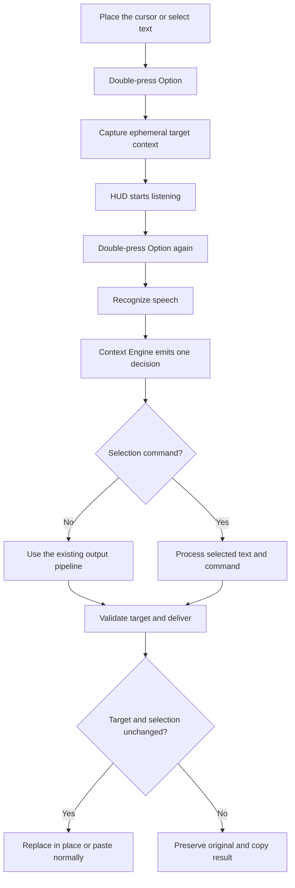
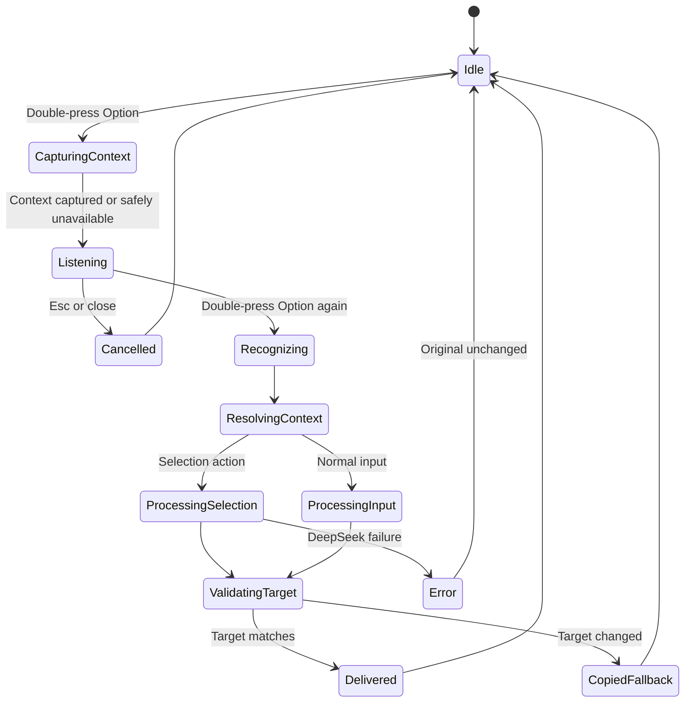

# ReadyType 1.6.0 Interaction and Technical Architecture

## 1. User Flow



## 2. Single Decision Model

`ContextDecision` is the only context object accepted by downstream processing:

```swift
struct ContextDecision: Equatable {
    let intent: InputIntent
    let appProfile: AppProfile
    let outputMode: OutputMode
    let scenario: OutputScenario
    let tone: OutputTone
    let outputLanguage: OutputLanguage
    let confidence: DecisionConfidence
    let reasons: Set<ContextReason>
}
```

Call sites cannot alter the priority order:

1. Explicit spoken instruction.
2. Valid selection and edit intent.
3. Manual user selection.
4. `AppProfileCatalog`.
5. Semantic scenario.
6. Generic defaults.

`reasons` is limited to tests, diagnostics, and user-readable summaries. Raw reasons are not analytics fields.

## 3. Module Boundaries

### `ActiveTextContextProvider`

- Reads the frontmost app, focused element, and explicit selection before recording.
- Reads no surrounding page content.
- Produces in-memory `ActiveTextContext`, released when the workflow ends.

### `AppProfileCatalog`

- Centralizes bundle-to-category mapping instead of scattered string checks.
- Profiles describe product behavior and do not construct prompts.
- Unknown apps return `.generic`; fuzzy matches cannot force a specialized scenario.

### `SelectionIntentResolver`

- Distinguishes edit instructions from ordinary dictated replacement text.
- Uses a bounded, testable intent set.
- Uncertain input remains ordinary dictation, preventing accidental selected-text transmission.

### `ContextEngine`

- Pure logic with no network, UI, or file writes.
- Combines selection, app profile, manual settings, and transcript semantics.
- Returns one immutable `ContextDecision`.

### `SelectionActionProcessor`

- Calls DeepSeek only for a selection-aware AI decision.
- Builds prompts from action type, selected text, target language, and tone.
- Preserves existing constraints against inventing facts, names, dates, commitments, or attachments.

### `SelectionReplacementGuard`

- Re-reads frontmost app, focus, selection range, and text before delivery.
- Replaces only when the fingerprint matches.
- Uses the existing clipboard fallback when it does not match and never guesses a new cursor location.

## 4. State Model



## 5. HUD Copy

| State | Normal input | Selection action |
| --- | --- | --- |
| Listening | Listening | Say how you want to change it |
| Recognition | Recognizing | Recognizing |
| AI | Polishing | Editing |
| Success | Pasted | Replaced |
| Target changed | Copied to clipboard | Target changed. Result copied |
| AI failure | Existing error copy | Could not edit. Original unchanged |

The 1.5.0 capsule dimensions, material, waveform, and cancel behavior remain unchanged.

## 6. Safety Invariants

1. Never delete or modify the original selection before DeepSeek returns.
2. Never write automatically when the target fingerprint does not match.
3. Cancel, timeout, and error paths release ephemeral context.
4. Direct dictation never includes selected text in a network request.
5. Analytics accept only enum and bucket values.

## 7. Future Learning Boundary

Version 1.6.0 may define a stable `DeliveryReceipt` containing action type, target category, output range, and expiry, but it does not monitor edits or persist content. Any 1.7.0 confirm-first correction learning must separately design bounded observation, diffing, repetition thresholds, confirmation, undo, and privacy controls.
