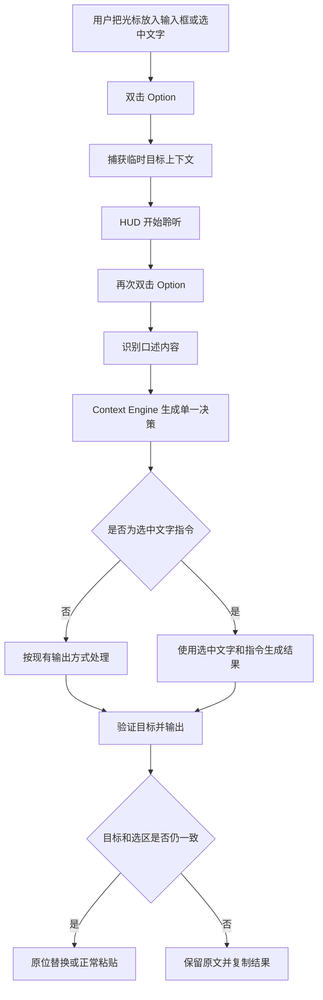
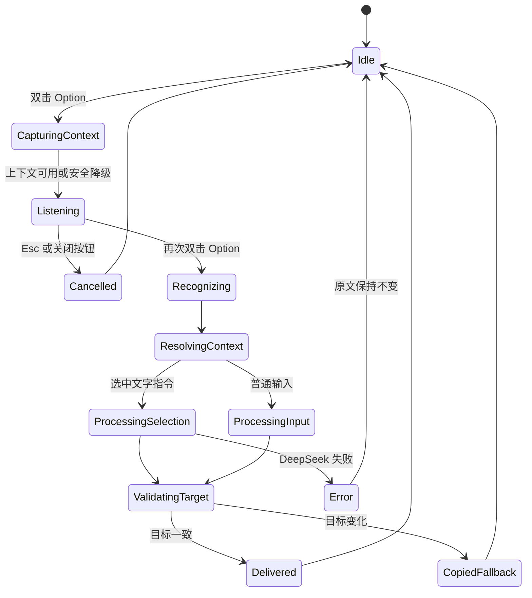

# ReadyType 1.6.0 交互与技术架构

## 1. 用户流程



## 2. 单一决策模型

`ContextDecision` 是后续处理唯一接受的上下文结果：

```swift
struct ContextDecision: Equatable {
    let intent: InputIntent
    let appProfile: AppProfile
    let outputMode: OutputMode
    let scenario: OutputScenario
    let tone: OutputTone
    let outputLanguage: OutputLanguage
    let confidence: DecisionConfidence
    let reasons: Set<ContextReason>
}
```

决策优先级不可由调用点自行改变：

1. 明确口述指令。
2. 有效选中文字与修改意图。
3. 用户手动选择。
4. `AppProfileCatalog`。
5. 语义场景。
6. 通用默认值。

`reasons` 只用于测试、诊断和用户可理解的结果说明，不进入匿名统计原始字段。

## 3. 模块边界

### `ActiveTextContextProvider`

- 在开始录音前读取前台 App、焦点元素和选中文字。
- 只读取当前明确选区，不读取页面其他内容。
- 生成内存态 `ActiveTextContext`，流程结束立即释放。

### `AppProfileCatalog`

- 集中维护 Bundle ID 与 App 类型映射，替代散落的字符串判断。
- Profile 只描述产品行为，不直接拼接 Prompt。
- 未知 App 返回 `.generic`，不能因为模糊匹配强制进入特定场景。

### `SelectionIntentResolver`

- 判断口述内容是修改指令还是普通输入。
- 使用有限、可测试的意图集合，不把任意短语映射成新功能。
- 无法确定时按普通输入处理，避免意外发送选中文字。

### `ContextEngine`

- 纯逻辑、无网络、无 UI、无文件写入。
- 合并选区、App Profile、手动设置和语义结果。
- 输出一个不可变 `ContextDecision`。

### `SelectionActionProcessor`

- 仅当决策为选中文字 AI 操作时调用 DeepSeek。
- Prompt 由动作类型、选中文字、目标语言和语气组成。
- 继续遵守“不编造事实、名称、日期、承诺和附件”的现有约束。

### `SelectionReplacementGuard`

- 输出前重新读取前台 App、焦点元素、选区范围和文本。
- 只有指纹匹配时才调用原位替换。
- 不匹配时调用现有剪贴板降级，不尝试猜测新光标位置。

## 4. 关键状态



## 5. HUD 文案

| 状态 | 普通输入 | 选中文字操作 |
| --- | --- | --- |
| 录音 | 正在听 | 说说想怎么修改 |
| 识别 | 正在识别 | 正在识别 |
| AI | 正在整理 | 正在修改 |
| 成功 | 已粘贴 | 已替换 |
| 目标变化 | 已复制到剪贴板 | 目标已变化，结果已复制 |
| AI 失败 | 保持现有错误文案 | 暂时无法修改，原文未变 |

胶囊尺寸、材质、波形和取消方式保持 1.5.0，不在本版本重新设计视觉系统。

## 6. 安全不变量

1. 在 DeepSeek 返回前不删除或修改原选中文字。
2. 目标指纹不匹配时永远不自动写入。
3. 取消、超时和错误均释放临时选区上下文。
4. 直接转文字不得携带选中文字进入网络请求。
5. 匿名统计只接收枚举和分桶值。

## 7. 后续自学习接口

1.6.0 只预留稳定的 `DeliveryReceipt`：动作类型、目标类别、输出范围和过期时间。它不监听修改、不保存正文。1.7.0 若实现确认式纠正学习，必须单独设计短时观察、文本差异、重复阈值、用户确认、撤销和隐私开关，不能在 1.6.0 中隐式启用。
